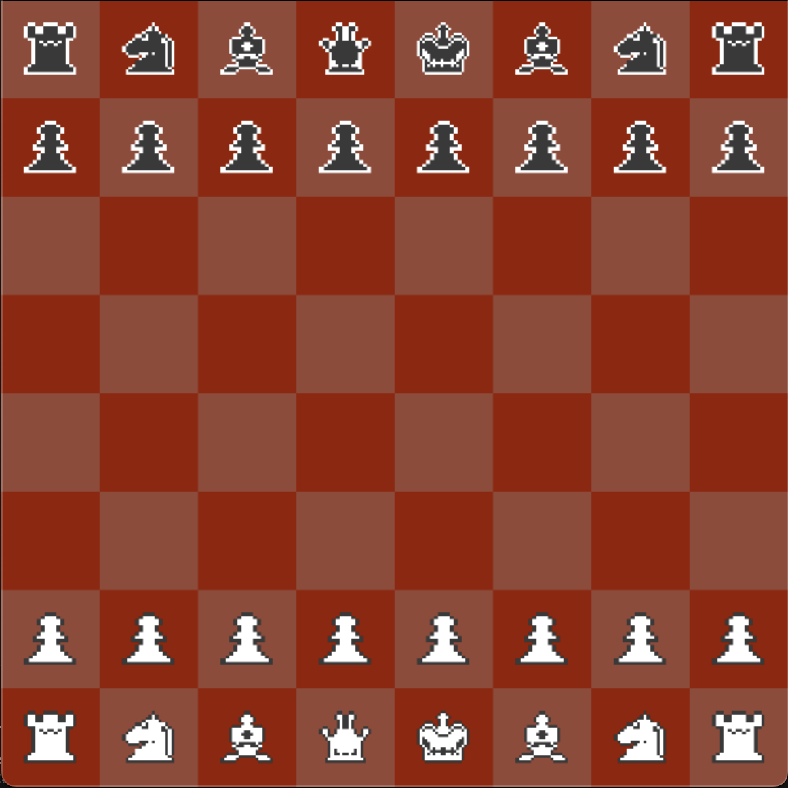

# Chess Game (Pygame)


A fully interactive, two-player chess game built using **Python** and **Pygame**, featuring a clean GUI, start menu, and restart functionality.

---

## ✨ Features
- **Fully Playable Chess**: Move, capture, and play under standard chess rules.
- **Interactive GUI**: Clickable pieces and visual feedback.
- **Menus**: Start screen and restart options when a game ends.
- **Dynamic Rendering**: Responsive chessboard and piece placement.
- **Built with Pygame**: Smooth animations and event handling.

---

## 📸 Screenshots
*(Add screenshots here by placing image files in the repo and linking them)*

Example:


---

## 🛠 Installation & Setup
### Requirements
- Python 3.8+
- [Pygame](https://www.pygame.org/wiki/GettingStarted)

Install dependencies:
```bash
pip install pygame
```

### Run the Game
1. Clone this repository:
   ```bash
   git clone https://github.com/yourusername/chess-game.git
   cd chess-game
   ```
2. Start the game:
   ```bash
   python main.py
   ```

---

## 🎮 Controls
- **Left Click**: Select a piece or move to a valid square.
- **Restart**: Use the in-game restart button after checkmate/stalemate.
- **Exit**: Close the window to quit.

---

## 📂 File Structure
```
chess-game/
│
├── main.py          # Entry point of the game
├── game.py          # Game logic (turns, states, updates)
├── board.py         # Chessboard and tile handling
├── piece.py         # Chess pieces and movement logic
├── button.py        # Start/restart button logic
├── constants.py     # Configuration (colors, screen size, FPS)
└── README.md
```

---

## ⚠ Known Issues
- Exiting the game window abruptly can cause a cleanup error due to multiple `pygame.quit()` calls.  
  *Planned fix:* Restructure event loops to avoid redundant quits.

---

## 🚀 Future Roadmap
- Add **AI opponent** for single-player mode.
- Implement **move highlighting**, **undo/redo**, and **sound effects**.
- Improve animations and add theme customization.

---

## 🤝 Contributing
Contributions are welcome! Fork the repository and submit a pull request for any improvements, bug fixes, or features.

---

## 📜 License
This project is open source under the [MIT License](LICENSE).

---
